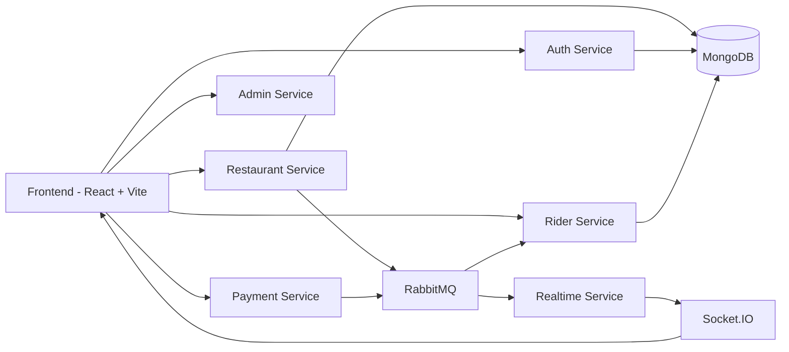
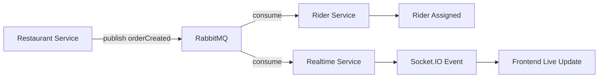
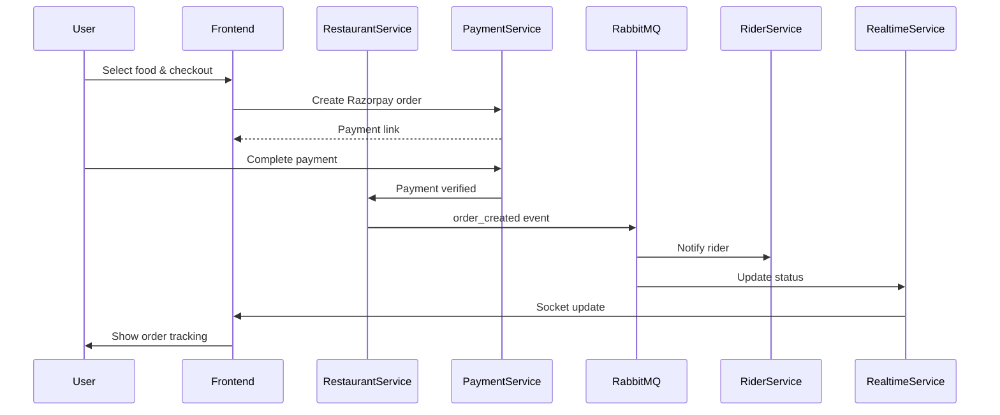

# 🍔 DineFlow

A **microservices-based food delivery platform** inspired by Zomato and Swiggy.
GYMato demonstrates a **scalable backend architecture** using **Node.js microservices, RabbitMQ event-driven communication, real-time updates with Socket.IO, and Docker containerization**.

The platform supports **users ordering food, restaurants managing menus, riders delivering orders, real-time tracking, and secure payment processing**.

---

# 📌 Project Overview

GYMato is designed to simulate a **real-world food delivery platform architecture**.

Instead of a monolithic backend, the system is built using **multiple independent services** communicating through **RabbitMQ message queues** and **REST APIs**.

Key highlights:

* Microservices architecture
* Event-driven communication
* Real-time order tracking
* Role-based system (User / Admin / Rider)
* Razorpay payment integration
* Docker containerization
* Cloud-hosted message broker (AWS)

---

# 🧠 System Architecture



The system uses **two communication models**:

### Synchronous Communication

Frontend directly calls backend services via **REST APIs**.

Example:

```
Frontend → Auth Service
Frontend → Restaurant Service
Frontend → Rider Service
```

---

### Asynchronous Communication

Services communicate using **RabbitMQ message queues**.

Example:

```
Restaurant Service
      │
      ▼
Publish orderReady event
      │
      ▼
RabbitMQ
      │
      ▼
Rider Service consumes event
```

---

# ⚡ Event Driven Architecture



RabbitMQ ensures **loose coupling between services** and improves scalability.

---

# 📦 Microservices

The backend is divided into independent services.

## 1️⃣ Auth Service

Handles authentication and user management.

Features:

* User registration
* Login
* Google OAuth login
* JWT authentication
* Auth middleware

Structure:

```
auth
 ├ config
 ├ controllers
 ├ middleware
 ├ models
 └ routes
```

---

## 2️⃣ Admin Service

Manages administrative operations.

Features:

* Add restaurants
* Manage menu items
* Admin dashboard

---

## 3️⃣ Restaurant Service

Core business service responsible for restaurant operations.

Features:

* Restaurant management
* Menu management
* Cart operations
* Order creation
* Order event publishing

Events published:

```
order_created
order_ready
```

---

## 4️⃣ Rider Service

Handles delivery partner operations.

Features:

* Rider authentication
* Accept delivery requests
* Receive order events from RabbitMQ

Consumes event:

```
orderReady
```

---

## 5️⃣ Realtime Service

Handles real-time updates using **Socket.IO**.

Features:

* Live order tracking
* Rider location updates
* Order status notifications

---

## 6️⃣ Payment Service

Handles payment processing using **Razorpay**.

Features:

* Create Razorpay orders
* Verify payment signatures
* Publish payment success events

Payment flow:

```
Checkout
   ↓
Create Razorpay order
   ↓
User completes payment
   ↓
Verify signature
   ↓
Publish paymentSuccess event
```

---

# 💻 Frontend

The frontend is built using **React + TypeScript + Vite**.

Structure:

```
frontend
 ├ components
 ├ pages
 ├ context
 ├ utils
 └ assets
```

Important pages:

### User Pages

```
Home
RestaurantPage
Cart
Checkout
Orders
Account
```

### Admin Pages

```
Admin Dashboard
Add Restaurant
Add Menu Item
```

### Rider Pages

```
Rider Dashboard
Current Orders
Delivery Map
```

---

# ⚡ Real-Time Order Updates

```mermaid
flowchart LR

A[Restaurant prepares order]
      ↓
B[RabbitMQ Event]
      ↓
C[Realtime Service]
      ↓
D[Socket.IO]
      ↓
E[Frontend receives update]
```

Socket.IO enables **live order status tracking**.

---

# 💳 Payment Integration

Payments are handled using **Razorpay**.

Steps:

```
User places order
      ↓
Create Razorpay order
      ↓
User completes payment
      ↓
Verify payment signature
      ↓
Order confirmed
```

---

# 📊 Order Lifecycle



---

# 🐳 Docker Setup

Each microservice runs inside its own container.

Services include:

```
auth
admin
restaurant
rider
realtime
utils
frontend
```

Each service contains a **Dockerfile**.

Example:

```
auth/Dockerfile
restaurant/Dockerfile
rider/Dockerfile
realtime/Dockerfile
utils/Dockerfile
```

---

# ☁️ Cloud Infrastructure

* RabbitMQ hosted on **AWS**
* Dockerized services
* Event-driven architecture

---

# 📦 Tech Stack

## Frontend

* React
* TypeScript
* Vite

## Backend

* Node.js
* Express.js
* TypeScript

## Database

* MongoDB

## Messaging

* RabbitMQ

## Realtime Communication

* Socket.IO

## Payments

* Razorpay

## Cloud

* AWS

## Containerization

* Docker

## Media Storage

* Cloudinary

---

# 🚀 Installation

Clone the repository

```
git clone https://github.com/Nikhiy/GYMato.git
```

Navigate into project

```
cd GYMato
```

Install dependencies

```
npm install
```

Run development servers

```
npm run dev
```

---

# 🐳 Run Using Docker

Build containers

```
docker build .
```

Run containers

```
docker run
```

---

# 🎯 Key Features

* Microservices architecture
* Event-driven system using RabbitMQ
* Real-time order tracking
* Role-based system (User / Admin / Rider)
* Secure authentication
* Payment gateway integration
* Dockerized services
* Cloud messaging infrastructure

---

# 📈 Future Improvements

* API Gateway implementation
* Redis caching
* Kubernetes deployment
* Rate limiting
* Service discovery
* Load balancing

---

# 👨‍💻 Author

**Nikhil Y**

GitHub:
https://github.com/Nikhiy
